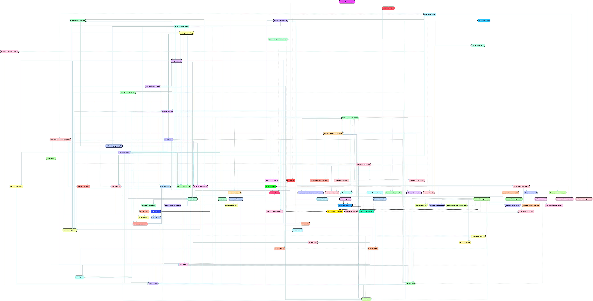

# Go Modules clarified

[](https://opensource.org/licenses/MIT)
[](https://github.com/Helcaraxan/gomod/actions?query=workflow%3APremerge)
[](https://codeclimate.com/github/Helcaraxan/gomod/maintainability)
[](https://codeclimate.com/github/Helcaraxan/gomod/test_coverage)

`gomod` is your one-stop-solution for making sense of your project's dependency graph. It supports
the querying and visualising of the graphs of both your Go module dependencies as well as the
underlying package import graph. It also comes with built-in analysis tools that extract information
from the dependency graph that is usually hidden or hard to get to via other means.

Typical questions that `gomod` will help you answer are:

- Why does my project have this module or package as a dependency.
- What dependency chains lead to `github.com/foo/bar` and what constraints do they put on versions?
- How old are the modules that my project depends on, and how much out-of-date are these?
- Are different dependencies of my project using potentially conflicting forks of the same module?

## Table of Contents

- [Go Modules clarified](#go-modules-clarified)
  - [Table of Contents](#table-of-contents)
  - [Detailed features](#detailed-features)
    - [Dependency analysis commands](#dependency-analysis-commands)
      - [`gomod graph`](#gomod-graph)
      - [`gomod reveal`](#gomod-reveal)
      - [`gomod analyse`](#gomod-analyse)
  - [Example output](#example-output)
    - [Full dependency graph](#full-dependency-graph)
    - [Shared dependencies](#shared-dependencies)
    - [Dependency chains](#dependency-chains)
    - [Hidden `replace`'s](#hidden-replaces)
    - [Dependency statistics](#dependency-statistics)

## Detailed features

### Dependency analysis commands

#### `gomod graph`

Output your module dependency or package import graph in [DOT format]. You can filter out noise from
the graph by tailoring your query to your needs. You can also add annotations to provide further
information on the generated graph. By default `gomod graph` will act on the module graph, however
by using the `--packages` flag it will consider the package import graph instead.

If no query is specified the full graph, including test-only dependencies will be produced.

Querying is done by means of a simple language that supports the following features:

| Filter Syntax                   | Feature                                                                                                                                      |
| ------------------------------- | -------------------------------------------------------------------------------------------------------------------------------------------- |
| `github.com/**/lib/*`           | Filter based on paths, including the ability to use wildcards. `*` matches a single path elements, `**` matches any number of path elements. |
| `github.com/foo/bar:test`       | Include test-only dependencies matched by the specified pattern.                                                                             |
| `deps|rdeps(<filter>[, <int>])` | Consider all (reverse) dependencies of the elements matches by the nested filter, potentially limited to a certain depth.                    |
| `shared(<filter>)`              | Consider only nodes that have more than one predecessor (i.e are a dependency required by more than one source).                             |
| `<filter> <operator> <filter>`  | Perform a set-based operation (`+`, `-`, `inter` or `delta`) on the outcomes of the two given filters.                                       |

Some examples:

- Print the full dependency graph of this module (not including test-only dependencies):

  ```shell
  gomod graph '**'
  ```

- Print the graph of all shared dependencies, including test-only ones, of a given package.
  source.

  ```shell
  gomod graph --packages 'shared(deps(github.com/my/module/library/pkg:test))'
  ```

- Show only the dependency graph leading to the `gopkg.in/yaml.v2` and `gopkg.in/yaml.v3` modules:

  ```shell
  gomod graph 'rdeps(gopkg.in/yaml.v2:test + gopkg.in/yaml.v3:test)'
  ```

- Show the same dependency graph as above but limited to the paths shared between both modules. Note
  that the resulting graph will not include the two targeted modules themselves.

  ```shell
  gomod graph 'rdeps(gopkg.in/yaml.v2:test) inter rdeps(gopkg.in/yaml.v3:test)'
  ```

If you want to create an image based on the generated text-based DOT content you need to use the
[`dot`] tool which you will need to install separately.

The generated graph is colour and shape-coded:

- Each module, or group of packages belonging to the same module, has a distinct colour.
- Test-only dependencies are recognisable by the use of a lighter colour-palette.
- Test-only edges are recognisable by a light blue colour.
- Edges reflecting indirect module dependencies are marked with dashed instead of continuos lines.

[DOT format]: https://graphviz.org/doc/info/lang.html
[`dot`]: https://www.graphviz.org/download/

#### `gomod reveal`

Show all the places at which your (indirect) module dependencies use `replace` statements which you
might need to account for in your own `go.mod` in order to build your project.

#### `gomod analyse`

Produce a short statistical report of what is going on with your dependencies. The report includes
things like (in)direct dependency counts, mean and max dependency ages, dependency age distribution,
and more.

**NB**: This command can also be invoked as `gomod analyze` for those who intuitively use American
spelling.

## Example output

### Full dependency graph

The entire dependency graph for the `gomod` codebase, using clustering to reduce the image size.


### Shared dependencies

Graph with only the shared dependencies for the `gomod` project.


### Dependency chains

Specific zoom on the dependency chains leading to the `github.com/stretchr/testify` module with
version annotations.


### Hidden `replace`'s

Revealing hidden replaces in the [Matterbridge] dependency graph. One is accounted for, the other is
not. This can be the cause of unexpected errors when building the project.

```text
 -> gomod reveal
'github.com/Rhymen/go-whatsapp' is replaced:
   maunium.net/go/mautrix-whatsapp -> github.com/tulir/go-whatsapp @ v0.0.2-0.20190528182350-fde573a2a73b

'gopkg.in/russross/blackfriday.v2' is replaced:
 ✓ maunium.net/go/mautrix            -> github.com/russross/blackfriday/v2 @ v2.0.1
 ✓ maunium.net/go/mautrix-appservice -> github.com/russross/blackfriday/v2 @ v2.0.1
 ✓ maunium.net/go/mautrix-whatsapp   -> github.com/russross/blackfriday/v2 @ v2.0.1

[✓] Match with a top-level replace in 'github.com/42wim/matterbridge'
```

[Matterbridge]: https://github.com/42wim/matterbridge

### Dependency statistics

Statistical analysis of the `gomod` dependency graph.

```text
 -> gomod analyse
-- Analysis for 'github.com/Helcaraxan/gomod' --
Dependency counts:
- Direct dependencies:   10
- Indirect dependencies: 28

Age statistics:
- Mean age of dependencies: 15 month(s) 18 day(s)
- Maximum dependency age:   58 month(s) 17 day(s)
- Age distribution per month:

  18.42 % |          #
          |          #
          |          #
          |          #
          |    _   _ #   _   _
          |    #   # #   #   #
          |    #   # #   #   #
          |  _ # _ # # _ #   #     _
          |  # # # # # # #   #     #
          |# # # # # # # # # # #   #           #     #         #     #
   0.00 % |___________________________________________________________
           0                                                        60

Update backlog statistics:
- Number of dependencies with an update:  12 (of which 0 are direct)
- Mean update backlog of dependencies:    10 month(s) 4 day(s)
- Maximum update backlog of dependencies: 18 month(s) 4 day(s)
- Update backlog distribution per month:

  25.00 % |            #
          |            #
          |            #
          |            #
          |            #
          |            #
          |            #
          |  # #       # #     # #     #   # # #
          |  # #       # #     # #     #   # # #
          |  # #       # #     # #     #   # # #
   0.00 % |_____________________________________
           0                                  19

Reverse dependency statistics:
- Mean number of reverse dependencies:    1.42
- Maximum number of reverse dependencies: 4
- Reverse dependency count distribution:

  76.32 % |  #
          |  #
          |  #
          |  #
          |  #
          |  #
          |  #
          |  #
          |  #
          |  # # # _
   0.00 % |_________
           0       5
```
